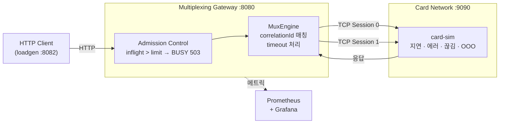
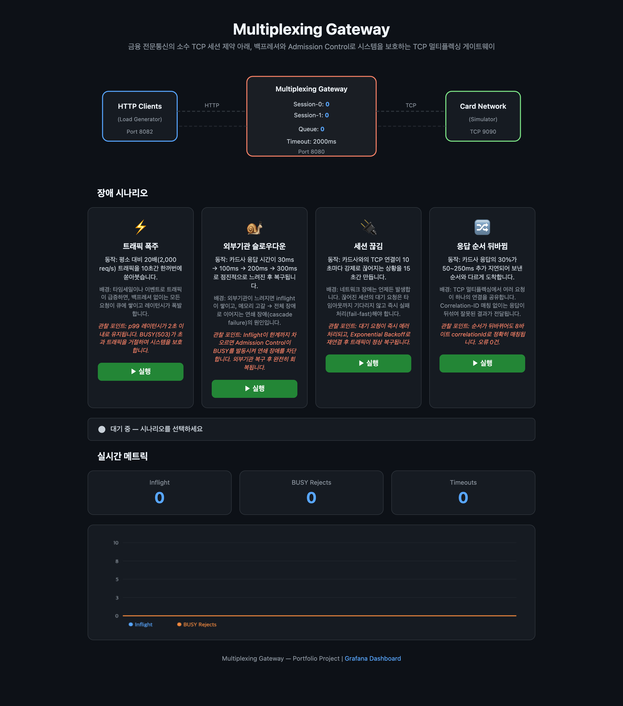
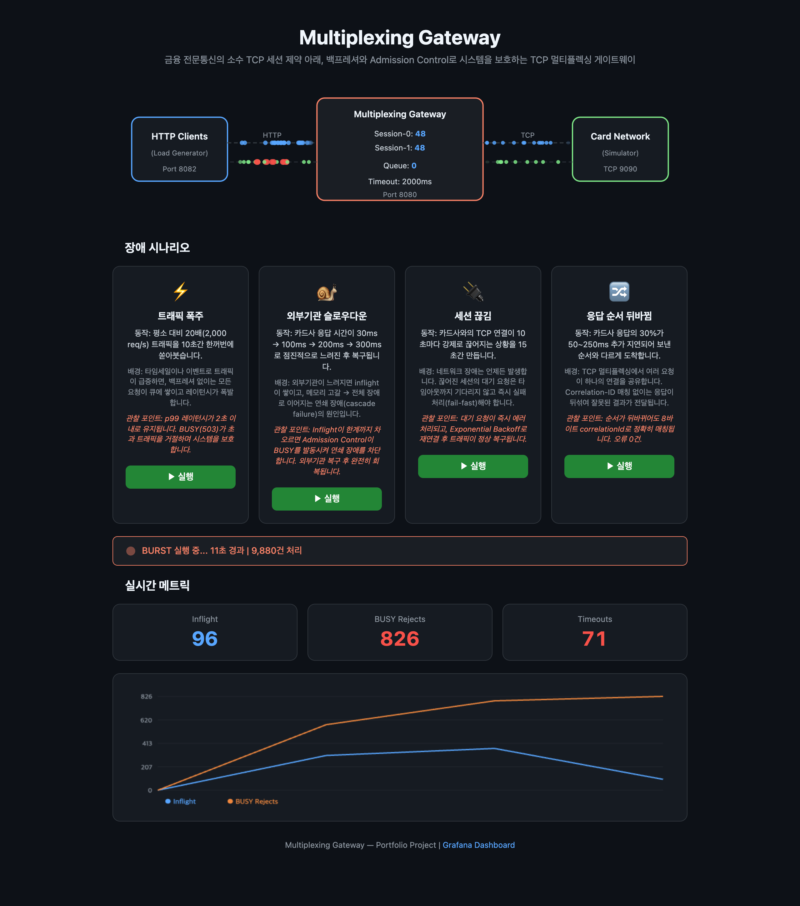
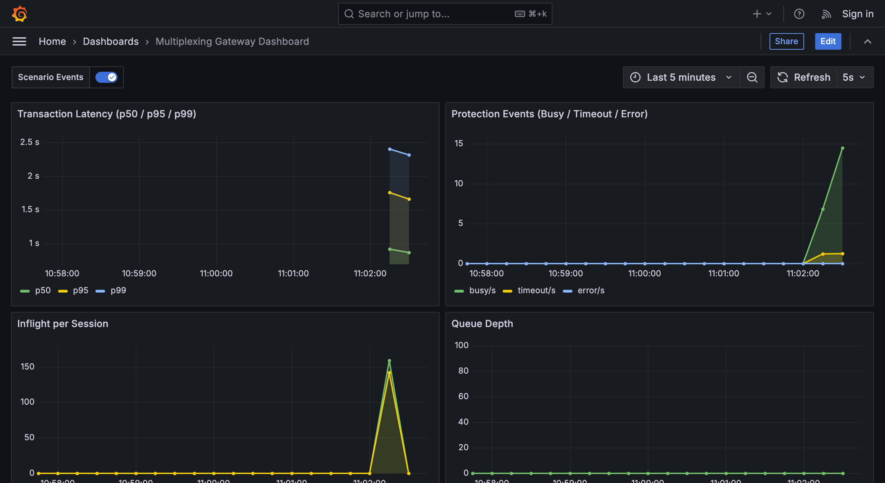

# Multiplexing Gateway

> 금융 전문통신의 소수 TCP 세션 제약 아래, 백프레셔로 시스템을 보호하는 TCP 멀티플렉싱 게이트웨이

---

## 배경

카드사/은행 같은 금융 외부기관은 TCP 세션을 1~2개밖에 안 줌. 근데 결제 요청은 수천 건이 동시에 들어옴.

| 상황 | 문제 | 해결 |
|------|------|------|
| **트래픽 폭주** | 요청이 쌓이면서 레이턴시 폭발 | inflight 한계 초과 시 BUSY(503) 즉시 거절 |
| **외부기관이 느려짐** | inflight 쌓임 → 메모리 고갈 → 연쇄 장애 | 세션별 inflight limit으로 cascade 차단 |
| **연결 끊김** | 대기 요청이 타임아웃까지 멈춤 | fail-fast 에러 처리 + backoff 재연결 |

---

## 아키텍처



바이너리 프로토콜: `[LEN 4B][CORRELATION_ID 8B][MSG_TYPE 2B][BODY ...]`
- `CORRELATION_ID` 8바이트로 요청-응답 매칭

---

## 빠른 시작

```bash
git clone https://github.com/Songdoeon/network.git && cd network
docker compose up -d
open http://localhost:8082
```

| URL | 설명 |
|-----|------|
| `http://localhost:8082` | 컨트롤 패널 — 시나리오 실행, 실시간 메트릭, 아키텍처 다이어그램 |
| `http://localhost:3000` | Grafana 대시보드 |
| `http://localhost:8080` | Gateway API |

### 컨트롤 패널



### BURST 시나리오 실행 중



### Grafana 대시보드



---

## 장애 시나리오 — 실측 결과

| 시나리오 | 조건 | p99 | APPROVED | BUSY | 에러 |
|---------|------|-----|----------|------|------|
| **Burst** | 20배 트래픽 + 외부기관 500ms 지연 | 2,085ms | 26.4% | **66.7%** | 4.2% |
| **Slowdown** | 응답 지연 30ms → 300ms → 복구 | 507ms | 99.0% | - | 0% |
| **Session Drop** | TCP 연결 10초마다 강제 끊김 | 128ms | 98.9% | - | 0.03% |
| **Out-of-Order** | 응답 30%가 순서 뒤바뀜 | 298ms | 99.2% | - | 0% |

- **Burst** — 20배 부하에서 BUSY가 66.7%를 거절하면서 시스템 생존.
- **Slowdown** — 외부기관이 10배 느려져도 에러 없이 처리.
- **Session Drop** — 끊긴 세션의 요청은 fail-fast 처리. backoff 재연결 후 복구.
- **Out-of-Order** — 응답 순서가 뒤섞여도 correlationId로 100% 매칭.

### Virtual Threads 적용 전후 (Burst 기준)

| | Platform Threads | Virtual Threads |
|---|---|---|
| **BUSY** (의도된 거절) | 26.3% | **66.7%** |
| **ERROR** (의도하지 않은 실패) | 41.1% | **4.2%** |

Platform Threads에서는 Tomcat 스레드풀이 먼저 포화돼서 요청이 Admission Control까지 도달하기 전에 HTTP 계층에서 거부됨 (ERROR 41%). Virtual Threads 적용 후 대부분의 요청이 Admission Control까지 도달하게 되면서, 거절이 의도한 백프레셔(BUSY)에서 발생.

---

## 핵심 설계 결정

### correlationId 매칭

```java
// PendingMap.java
private final ConcurrentMap<String, PendingRequest> map = new ConcurrentHashMap<>();
```

요청 시 correlationId로 PendingRequest를 등록, 응답 시 같은 correlationId로 꺼내서 `future.complete()` 호출. ConcurrentHashMap이라 읽기 경로에 락 없음.

### Admission Control

```java
// AdmissionControl.java
UpstreamSession session = sessionPool.selectSession();
if (session == null) return false;                              // 활성 세션 없음
if (session.getInflightCount() >= maxInflight) return false;    // inflight 한계
```

큐에 쌓지 않고 즉시 503 거절. 느린 상태에서 큐에 쌓으면 모든 요청이 느려지고 메모리까지 터지기 때문에, 세션 inflight만 보고 판단.

### Fail-Fast + race condition 방지

```java
// MuxEngine.java — 세션 끊김 시
PendingRequest removed = pendingMap.remove(corrId);  // 원자적 제거
if (removed != null) {                                // 한쪽만 성공
    removed.getFuture().complete(
        new AuthorizeResponse(removed.getTxId(), TransactionStatus.ERROR, "UPSTREAM_DOWN", latencyMs, sessionId));
}
```

세션 끊기면 해당 요청 전부 즉시 에러 처리. `remove()` 반환값 null 체크로 타임아웃 스레드와의 중복 처리 방지.

### 멱등성

```java
// IngressController.java
CompletableFuture<AuthorizeResponse> existing = idempotencyStore.putIfAbsent(key, future);
if (existing != null) return existing.get(2, SECONDS);  // 이미 처리 중이면 그 결과 대기
```

`putIfAbsent()`를 submit 전에 호출해서, 동일 키 동시 요청 중 하나만 실행. 이중 결제 방지.

### CompletableFuture Bridge

HTTP 스레드와 Netty EventLoop 연결:

1. `submit()`에서 CompletableFuture 생성 → PendingMap 등록 → TCP 전송
2. HTTP 스레드(Virtual Thread)가 `future.get(timeout)`으로 대기. 가상 스레드라 캐리어 스레드를 점유하지 않음
3. 응답 도착 시 Netty EventLoop에서 `future.complete()` → HTTP 스레드 재개

---

## 기술 스택

| 계층 | 기술 |
|------|------|
| 언어 | Java 21 (Virtual Threads) |
| 프레임워크 | Spring Boot 3.3.6 |
| TCP | Netty 4.1.116 |
| 리액티브 | Spring WebFlux, Project Reactor (loadgen) |
| 메트릭 | Micrometer → Prometheus → Grafana |
| 레이턴시 측정 | HdrHistogram |
| 빌드 | Gradle 멀티모듈 |
| 인프라 | Docker Compose |

---

## 프로젝트 구조

```
network/
├── common/                 # 바이너리 프로토콜, DTO, 예외
│   └── protocol/           # Frame, FrameCodec, CorrelationIdGenerator
├── adapter-gateway/        # HTTP → TCP 멀티플렉싱 게이트웨이
│   ├── ingress/            # HTTP 엔드포인트
│   ├── mux/                # MuxEngine, PendingMap
│   ├── admission/          # AdmissionControl
│   ├── session/            # UpstreamSessionPool, TCP 세션 관리
│   ├── idempotency/        # 멱등성 보장
│   ├── transaction/        # TransactionLog
│   ├── config/             # GatewayProperties
│   ├── netty/              # Netty 파이프라인 (Decoder, Encoder, Handler)
│   └── observability/      # 메트릭 + 구조화 로깅
├── card-sim/               # 외부기관 시뮬레이터
│   ├── server/             # Netty TCP 서버
│   ├── scenario/           # 지연/에러/순서뒤바뀜/끊김 주입
│   └── api/                # 런타임 설정 API
├── loadgen/                # 부하생성기 + 웹 컨트롤 패널
│   ├── runner/             # 시나리오 실행
│   ├── demo/               # 웹 UI REST API
│   └── static/             # 컨트롤 패널 (HTML/CSS/JS)
├── observability/          # Prometheus + Grafana
├── docker-compose.yml
└── demo.sh
```

---

## 테스트

```bash
./gradlew test
```

- **adapter-gateway**: 통합 테스트 7개 (MockCardSimServer) + 단위 테스트 4개
- **common**: 10개 (프로토콜 코덱, ID 생성기)

통합 테스트에서 Netty TCP 목 서버를 띄우고 `@DynamicPropertySource`로 포트 주입해서, 실제 TCP 통신 경로 검증.
